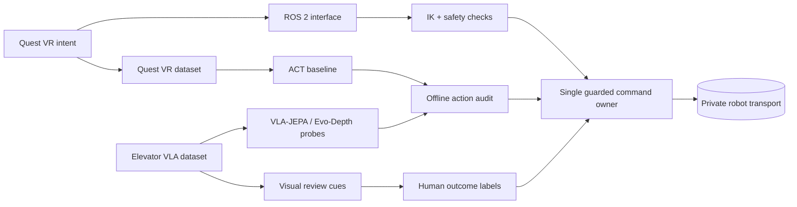

# Quest–Piper Embodied AI Portfolio

> A public, evidence-bounded record of building and evaluating a real robot-learning workflow: VR teleoperation, data contracts, VLA-JEPA migration, action-path auditing, and visual review.

## Research focus

**How can a VR teleoperation workflow become a reproducible robot-learning loop without confusing an interface test, an offline metric, and real closed-loop success?**

The portfolio is organized around ownership boundaries rather than a single model claim:



Only the reusable, hardware-independent contracts and aggregate evidence are public. The execution path remains private and guarded.

## Completed evidence

| Area | What I built or verified | Evidence level | Why it matters |
| --- | --- | --- | --- |
| Robot systems | Quest VR → ROS 2 → Pinocchio/CasADi IK → guarded command owner → private Piper transport; one writer owns transport. | Systems integration | Separates experimental policy code from actuation authority. |
| **Quest VR dataset** | 40 episodes, 14,653 frames, 30 FPS, two 640×480 RGB streams, aligned 7D state/action, timestamp/index QC. | Offline probe | Establishes a traceable small-data contract for ACT and teleoperation studies. |
| **Elevator VLA dataset** | 952 episodes, 188,418 frames, 12 task groups; two-view batches used for model and visual-review experiments. | Offline probe | Keeps the larger VLA experiment asset distinct from the Quest recording set. |
| VLA-JEPA 2.1 | 386 teacher tensors mapped, 12 reinitialized; strict loading and a 100-step real-data training pilot completed. | Offline probe | Demonstrates a controlled representation-model migration rather than an unverified swap. |
| Evo-Depth | 300-step action-head-only controlled pilot; same fixed 187-batch evaluation changed masked-flow loss 0.841452 → 0.244856. | Offline probe | Couples optimization evidence to a fixed evaluation protocol. |
| Visual review | HSV + component + temporal workflow emitted 421 candidates; 48 stratified samples were visually positive. | Offline probe | Reduces review effort without relabelling image evidence as success. |

## Two data assets, two roles

The dataset distinction is deliberate. The **Quest VR dataset** is the 40-episode / 14,653-frame LeRobot contract collected around the Quest-to-Piper workflow. The **Elevator VLA dataset** is the separate 952-episode / 188,418-frame asset used by VLA-JEPA, Evo-Depth, and wrist-video analysis. They are not interchangeable, and public reporting does not merge their statistics.

## Engineering foundation

Before the robot-learning integration work, I implemented and profiled a compact **3.37M-parameter Transformer** across 4/6/8-layer configurations. The accompanying operator graph tracks `[B,T,C]` transformations through RMSNorm, QKV projection, RoPE, attention, residual paths, and MLP blocks, alongside training-time measurements. This is presented as evidence of shape-level debugging and training-system literacy—not as a foundation-model contribution.

## Projects

| Project | Engineering question | Best entry point |
| --- | --- | --- |
| [01 · Quest–Piper safety](projects/quest_piper_safety/README.md) | How are stale or malformed candidates prevented from reaching private transport? | [Safety gate](projects/quest_piper_safety/core/safety_gate.py) |
| [02 · LeRobot data contract](projects/lerobot_data_contract/README.md) | How are units, frame metadata, and episode boundaries made auditable? | [Episode integrity validator](projects/lerobot_data_contract/core/episode_integrity.py) |
| [03 · VLA-JEPA integration](projects/vla_jepa_integration/README.md) | How can a teacher upgrade preserve tensor semantics and training ownership? | [Migration contract](projects/vla_jepa_integration/core/migration_contract.py) |
| [04 · Evo-Depth deployment](projects/evo_depth_deployment/README.md) | What must be constrained and measured before an endpoint experiment is interpreted? | [Action-chunk contract](projects/evo_depth_deployment/core/action_chunk.py) |
| [05 · Visual pre-annotation](projects/visual_preannotation/README.md) | How can video review be automated conservatively? | [Workflow and review sampler](projects/visual_preannotation/README.md#workflow) |

## Reading the evidence correctly

| Level | Meaning in this repository | It does **not** prove |
| --- | --- | --- |
| Systems integration | A private interface path was exercised under its safety boundary. | Public hardware reproduction or task success rate. |
| Offline probe | A contract, tensor, loss, timing scope, or visual audit was measured. | Policy generalization, real-time capability, or completed manipulation. |
| Closed-loop success | Timestamped command, feedback, and reviewed outcomes meet a stated criterion. | Anything inferred from a loss value or illuminated image alone. |

The [evidence index](docs/evidence.md) provides resume/interview framing; the [roadmap](docs/roadmap/README.md) lists the remaining acceptance gates.

## Run locally

```bash
python -m pip install -r requirements.txt
python -m unittest discover -s tests -v
```

The public modules use the Python standard library. The runtime helper records `hardware_commands_sent: false`; no public code can command a robot.

## Public boundary

This repository excludes raw demonstrations, task text, checkpoints, internal addresses/paths, device identifiers, calibration values, robot settings, and ROS/CAN/SDK control code. It is a portfolio of engineering decisions and verifiable offline contracts, not a deployable robot controller.

